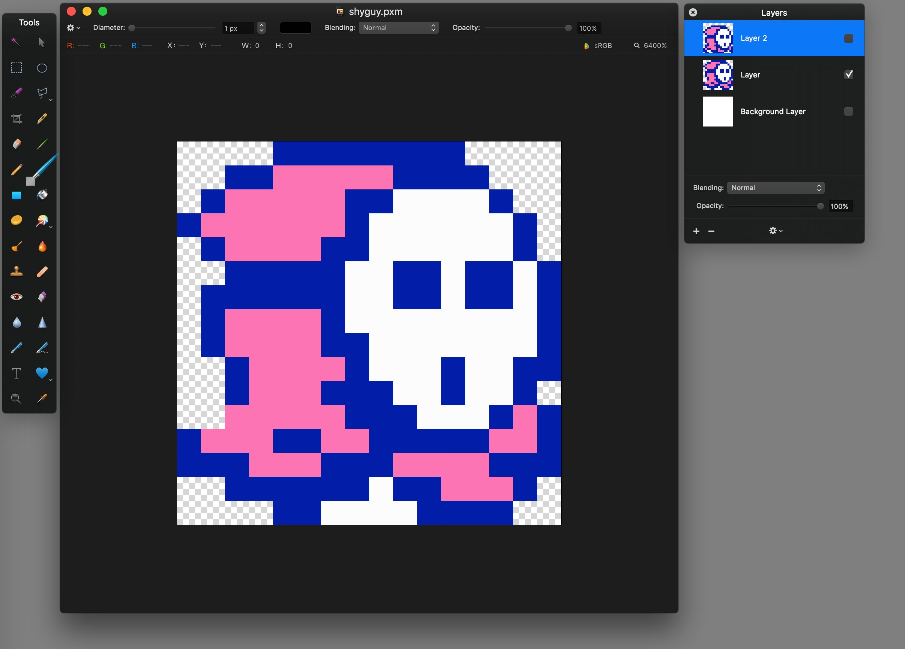
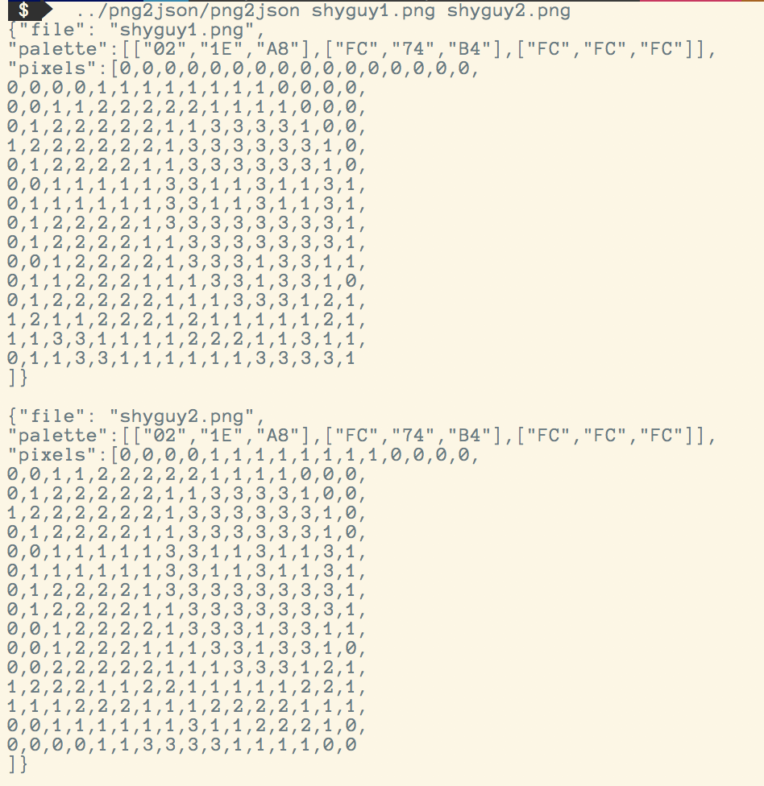
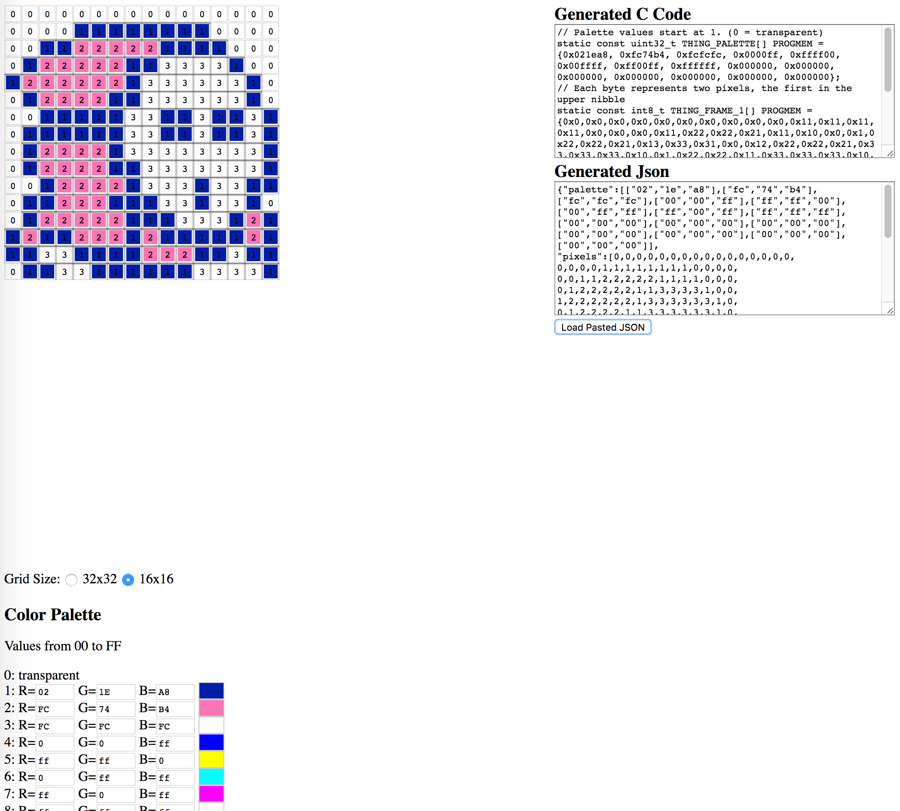

#NES Sprite Display

##Overview

The NES Sprite Display project is an Arduino-based program to display assorted NES-era game sprites (primarily Super Mario and Zelda) on a large 32x32 LED matrix. 

_(Above: a rough approximation of the LED matrix animation. It's a little slow and choppy due to the synchronization between the gif framerate and the matrix framerate. Trust me, it looks a lot nicer in person.)_

The inspiration for this project came from a couple of different sources. Portland has an arcade bar, [Ground Kontrol](http://groundkontrol.com/), that offers a [Pac Man clock](http://groundkontrol.com/store/) for sale. This looks like it's probably a 32x16 LED matrix. It displays the time, with refreshes occurring via ghost and Pac-Man animations. ($75, while supplies last.) Second, I saw a vendor at the [Portland Retro Gaming Expo](http://www.retrogamingexpo.com/) (sorry, I didn't catch which one) that offered a smaller 16x16 LED matrix, in a nice wooden display case, that did similar animations. This was several hundred dollars. I figured I'd try my hand at making something fun, influenced by these two products.

This project is copyright 2016 by Brian Enigma, <brian@netninja.com>, and lives at <https://github.com/BrianEnigma/NES_Sprite_Display>. It is licensed under a [Creative Commons Attribution-ShareAlike 4.0 International License](http://creativecommons.org/licenses/by-sa/4.0/).

##Prerequisites

There are two main components to this project:

- The [Adafruit 32x32 RGB LED Matrix Panel, 6mm pitch](https://www.adafruit.com/products/1484) is the display. There are a few other electrically-compatible 32x32 displays, with differing pitches. You should be able to use whichever one you want, being mindful of the incompatibility of the 4mm-pitch display and the Nootropic Arduino (if you use that particular Arduino-alike as the CPU).
- An Arduino. I used the [Nootropic RGB Matrix Backpack Kit](https://www.adafruit.com/products/2657) because it's an Arduino-compatible board that connects directly to the DIP header on the back of the LCD matrix.

You will likely need some other support gear, if you do not already have it:

- A beefy 5VDC power supply, to power all those LEDs. I used [a 4000mA power supply](https://www.adafruit.com/products/1466) from Adafruit.
- If using the Nootropic board, an [FTDI Friend](https://www.adafruit.com/products/284) or [FTDI cable](https://www.adafruit.com/products/70) to level-convert USB down to TTL.
- Soldering iron and other electronics-building gear. You'll need to assemble the Nootropic board, wire up the matrix to power, etc.

##Phase Two: Realtime Clock

TODO: Document hooking up the realtime clock ([Adafruit DS3231 breakout board](https://www.adafruit.com/product/3013)) to the Arduino.

##Project Files

- `inspiration` — Sprite sheets I've downloaded from various places.
- `resources` — Sprite resources I've remastered in various formats, including PNG files, JSON equivalents, and C headers.
- `sprites.html` and `sprites.js` — An interactive browser-based tool for drawing sprites and generating corresponding C headers. It can save and load state using JSON files as well as export C headers.
- `png2json` — A tool to take a collection of PNG files, such as the frames of an animation, and export a common palette as well as JSON save-states (for `sprites.html`) for each frame of the animation.
- Test applications — Used while bringing up the hardware.
    - `NES_Sprites_Test_1` — Drawing a test pattern by code, as well as reading two different test patterns (plus corresponding palette list) from Flash memory, one using a byte per pixel and the other using a half-byte per pixel.
    - `NES_Sprites_Test_2` — Test drawing a two-frame 16x16 animation, read as a half-byte per pixel from Flash, rendered at 32x32.
    - `NES_Sprites_Test_3` — Same as 2, but optimizing reads into the palette Flash.
    - `NES_Sprites_Test_4` — Adding a routine to paint 16x32 sprites (such as the Piranha Plant), centered in the 32x32 display.
    - **Phase Two:**
    - `NES_Sprites_Test_5` — Combination of RGB drawing library and RTC library.
    - `NES_Sprites_Test_6` — Drawing time with a custom font.
    - `NES_Sprites_Test_7` — Drawing time “behind” a sprite without double-buffering.
- `NES_Sprites_1` — The final application without a clock, which loops through a collection of sprite animations.
- `NES_Sprites_2` — The final application with realtime clock (RTC) display. animations.

##Workflow for Creating Sprites

I used an application called [Pixelmator](http://www.pixelmator.com/mac/) for editing source images. You are free to use Photoshop, MS Paint, The Gimp, or whatever you wish. The rest of the steps use code from this project.

I started by copy/pasting sprites from online sprite sheets into 32x32 or 16x16 images, with transparency, and performed a little bit of cleanup. If you _are_ using Pixelmator, you should be able to see my source `*.pxm` files in the [`resources`](resources/) folder. These are layered images, with each layer representing a frame of the animation. I exported each frame of the animation as a `*.png` file, also in the `resources` folder.

The next step requires the png2json binary. The source code and Makefile are in the [`png2json`](png2json/) folder. This is a simple app and should compile without problems on a Mac or Linux system. Be aware that libgd is required, so if you do not have it installed, you will need to do so through your operating system's package manager (such as apt-get, yum, or brew). This application normalizes all of the image palettes into a common palette of (up to) 15 colors, then outputs each image as a set of pixels that index into that palette.

The next step requires pasting each of those JSON frames into the `sprites.html` browser app. This lets you interactively edit the pixels and palette colors. The C header in the top-right corner automatically regenerates with changes, so that can then be copy/pasted into an include file or directly into your Arduino application.

##Tips and Hints

I found that the LEDs are entirely too bright and point-focused. To help with this, I put a sheet of white cardstock paper in front of the matrix to act as a diffuser.

The Arduino code makes use of the [Adafruit RGB Matrix Panel library](https://github.com/adafruit/RGB-matrix-Panel), which in turn makes use of the [Adafruit GFX library](https://github.com/adafruit/Adafruit-GFX-Library). You should be able to easily load those into your Arduino IDE [by following a few simple steps](https://learn.adafruit.com/32x16-32x32-rgb-led-matrix/test-example-code).

##Future Tasks?

I would really like to integrate a clock into the project. Unfortunately, the Arduino doesn't keep time well and the Nootropic board I used doesn't directly expose the extra pins I'd need to easily wire up [a realtime clock daughter board](https://www.adafruit.com/products/3295?gclid=CL2prLzo7NACFVKGfgod5jUAeA) without doing something wacky like soldering directly to a microcontroller leg and/or making a fragile bluewire patch. Not impossible, and not out of the question, but not elegant.

I would also like to design and build a laser-cut bezel and/or enclosure. I might also incorporate a laser-cut diffuser, perhaps using a thin sheet of white translucent acrylic.
